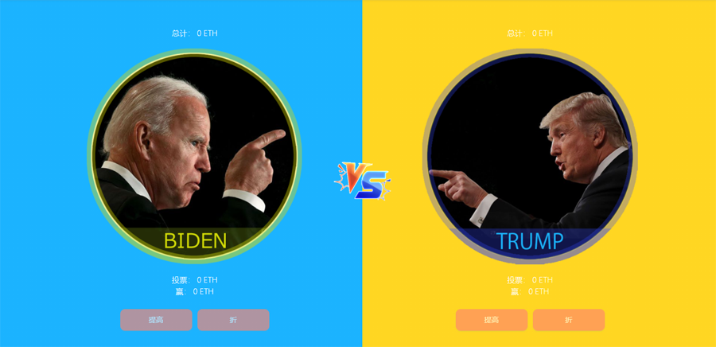

## Introduction

---
**O**ur team is developing a **BTC** **DeFi** project , which is a Killer Project with a scale of more than 10 billion **US** dollars. It will be the brightest blockchain project since the birth of **BTC**.

**I**n order to warm up the airdrop of the BTC DeFi project,and actively participate in the **US** Election 2020, we write this simple smart contract game. Any **ETH**address participating in this game can participate in the BTC airdrop of our future project, just as traders on uniswap can **GET UNI**.
## what are the rules of the game?

**Only One Rule:** The winners share equally all the bets of the losers.

## Does the project issue new tokens?

>YEP.

>**Name:** WWI.
>
>**WWI contract address:** null 
>
>**Total:** 21000.

We do not encourage anyone to hype WWI. It’s just a token of governance , which has no practical value.

> **Main functions:**
>
> - Mainly used for community governance, project voting.
>
> - Airdrop voucher. People who participate in this guessing game or contribute to it, that is, those who hold WWI, will get the BTC DeFi project airdrop in the future. 
 Just as traders on uniswap can get uni airdrops.
>
> - 50% of the foundation's income will be used to buy back WWI.However.

!> **Warning**: this election bet game only ETH betting is supported.

## Is the code open source?

>Yep.

>It has been open sourced on github. Formal audits are also underway.
>
>If you find a bug, please contact lovebitbtc@gmail.com, or contact the community assistant's telegram or WeChat.
>
>According to the degree of damage of the bug, 1-100 ETH will be rewarded.

## Is the project profitable?

>Yep.

>2% of the total prize pool will be injected into the foundation account. 
>
>The foundation will be audited every year and publicize expenditures. 50% of the foundation’s revenue was used to buy back WWI. 

## Is the whole process smart contract?

>Yep.

>We firmly believe in: **THE CODE IS LAW**.
>
>Except for the result judgment, they are all smart contracts. The smart contract has deprived the administrator of all permissions except for the result judgment, such as transfer, adding and deleting pools, etc.
>
>The ETH bet by all participants is in the smart contract, and no one, including the administrator, has the right to move it, which can ensure 100% safety of your ETH.
>
>Judgment results, there is currently no a safe solution, and multi-signatures will be used in the future to solve the result judgment problem.

##  After this presidential election, will continue to open new PK projects?

>Yes,welcome to propose the next PK event.
>If your suggestion is adopted, 1 ETH will be awarded.

>**The requirements for PK projects must be**: 
>- global events
>- fair result evaluation mechanism,
>- credible results announcement channels
>- clear results

## How to reward various marketing promotion volunteers?

We sincerely invite you join the marketing volunteer group and send the link of your promotion article to the administrator. The foundation will weight the number of articles read, likes, and fans. Contributors will equally get WWI reward.

## Notice

?> :bulb: If one drop out the election or suffers a life accident, the judgment will be based on the success or failure of his successor.

?>:bulb: The results will be based on the results of the Election Day vote on November 3, rather than the Electoral College vote on December 14.

?>:bulb: If one of the parties does not approve the election results, we will postpone the judgment of the game results until the Supreme Court makes a decision.

?>:bulb: So,the final  results will be based on the decision of the Supreme Court.

?>:bulb: The Greater China (Taiwan belongs to China)community is an important part of our project, and we have also invited a number of Chinese, Korean and Japanese volunteers through Twitter. Thank the Chinese community volunteers for their contribution to the translation of this article.

?>:bulb: Specifically, Chinese mainland person are prohibited from participating in this game (which is said to be restricted in Chinese mainland). However, we welcome your enthusiastic participation in our future BTC DeFi project. We also welcome everyone to volunteer in this game, earn and hold WWI, so that you can participate in the largest airdrop in the history of blockchain, which we will launch in the next few months.

## Contract Addresses:

>**BET Contract**: 0x2cB5f95a66f9206710d122C149C5530eD0804c02

>**WWI Contract**: 0x2cB5f95a66f9206710d122C149C5530eD0804c02

!> **Warning**: This project is still in *Beta*. Please **use at your own risk**.

## Community

>**Twitter**: https://twitter.com/Jackh19746616
>
>**Telegram**: https://t.me/Whowinco
>
>**Github**: https://github.com/
>
>**WeChat**: Add user **Lovebitbtc** and you'll be automatically invited to the group.
