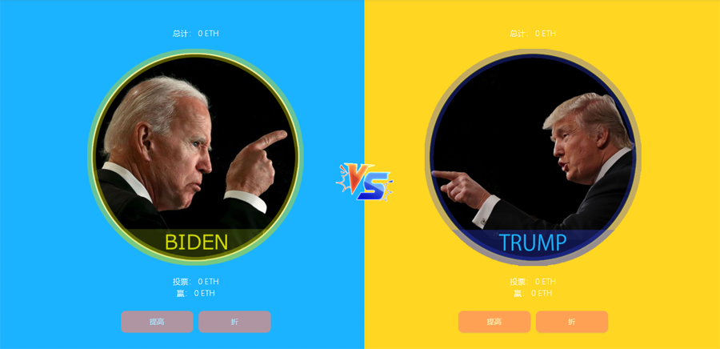

### 介绍

---
!> **提醒**: 该项目只支持**ETH**投放 **请知晓**.

我们的团队正在开发一个关于比特币的DeFi项目，这是一个超过100亿美元市场的杀手级项目，它将是自比特币诞生以来，最闪亮的一个区块链项目。

为了给项目空投预热，支持美国大选，我们做了这个简单的智能合约小游戏。凡是参与这个小竞猜游戏的ETH地址，就像在UNISWAP上的交易者能够获得UNI一样，将来皆可以参与我们未来项目的比特币空投。

### 1.游戏规则是什么？
只有一条：赢家共同平均瓜分输家的所有投注。
### 2.这个小游戏项目是否发币？
>是的。

>**名称：**WWI
>
>**WWI合约地址：**

>**总量：**21,000

我们不鼓励大家去炒作WWI，他仅仅是治理权代币，基本没有实用的价值。主要功能：1.主要用于社区治理，项目投票。2.空投凭证。参与这个小游戏的人，或者为这个小游戏做出贡献的人，也就是持有WWI的人，将来都将获得比特币DeFi项目空投。就像在UNISWAP上的交易者都能够获得UNI空投一样。3.基金会50%的收入将用于回购WWI。
但是，本次选举竞猜投注仅支持ETH。
### 3.是否开源？
是的。
已在github开源。正式的审计工作也正在进行。
如有发现bug，欢迎随时联系lovebitbtc@gmail.com，或者联系社区助手的telegram或wechat，我们将根据您发现的bug危害程度，奖励1-100个ETH。
### 4.本项目是否盈利？
是的。

参与者总奖池的2%，注入基金会账号。基金会将接受年终审计，并公示开支。同时，基金会收入的50%将用于回购WWI。

### 5.本项目是否全程智能合约？我们的资金是否安全？
是的。

我们坚信:代码即法律。
除了结果判定，都是智能合约。智能合约已经剥夺了管理员除了结果判定的一切权限，如转账、增删池等权限皆被剥夺。因此，所有参与者投注的ETH，都在智能合约，任何人包括管理员本人，均无权动用参与者的ETH，可以确保资金百分之百的安全。结果判定，目前还没有想到一个安全的解决方案，以后将用多签来解决结果判定问题。

### 6.这次大选做完，是否继续做其他的pk游戏？
可以，欢迎提出下一个PK事件，建议被采纳将奖励1个ETH。

>**要求PK事件必须是：**
>- 全球性事件
>- 有公正的结果评判机制
>- 有公信力的结果宣布渠道
>- 有明确的结果。
### 7.如何奖励各类推广志愿者？
只要有兴趣皆可以加入营销宣传志愿者群，把宣传文章链接和ETH公钥地址发给管理员，基金会将按照文章阅读数、点赞数和志愿者粉丝数加权计算，奖励WWI。
### 8.重要说明是什么？
&nbsp;&nbsp;&nbsp;&nbsp;如一方退选或生命发生意外，以其接任者的胜负为评判依据。
本次竞猜游戏结果的评判依据是：11月3日的选举日结果，而不是12月14日的选举团的选举结果。
如果双方有一方不承认选举结果，那么会推迟宣布结果，直到最高法院做出判决。
最后结果以最高法院的判决为最终依据。

&nbsp;&nbsp;&nbsp;&nbsp;大中华（台湾属于中国！）社区是我们项目的重要客户，我们也通过推特邀请了一批中文、韩语和日语志愿者。感谢中文社区志愿者为本文做出的翻译贡献。
但是，我们禁止中国大陆地区参与本次小游戏（据说这类游戏在中国大陆是被限制的），我们欢迎你们热情的参与到我们未来的比特币DeFi项目，我们也欢迎你们成为本次游戏的志愿者，赚取并持有WWI，以便于可以参与我们未来几个月即将要启动的区块链有史以来最大的空投。
-----------------------------

## 智能合约地址:

>**BET Contract**: 0x2cB5f95a66f9206710d122C149C5530eD0804c02

>**WWI Contract**: 0x2cB5f95a66f9206710d122C149C5530eD0804c02

!> **友情提醒**: 区块链项目有风险 **请自行承担。**.

## 社区活动

微信：Lovebitbtc

推特：[https://twitter.com/Jackh19746616](https://twitter.com/Jackh19746616)

电报：[https://t.me/Whowinco](https://t.me/Whowinco)

-----------------------------